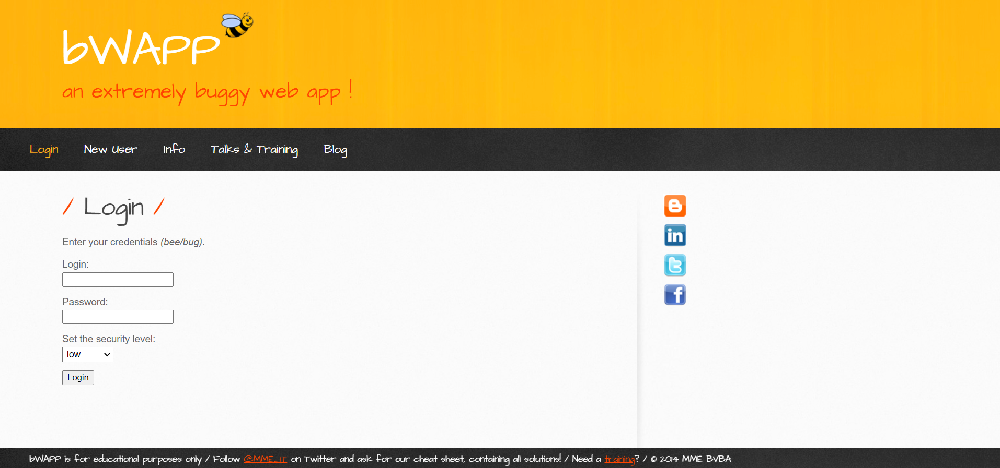
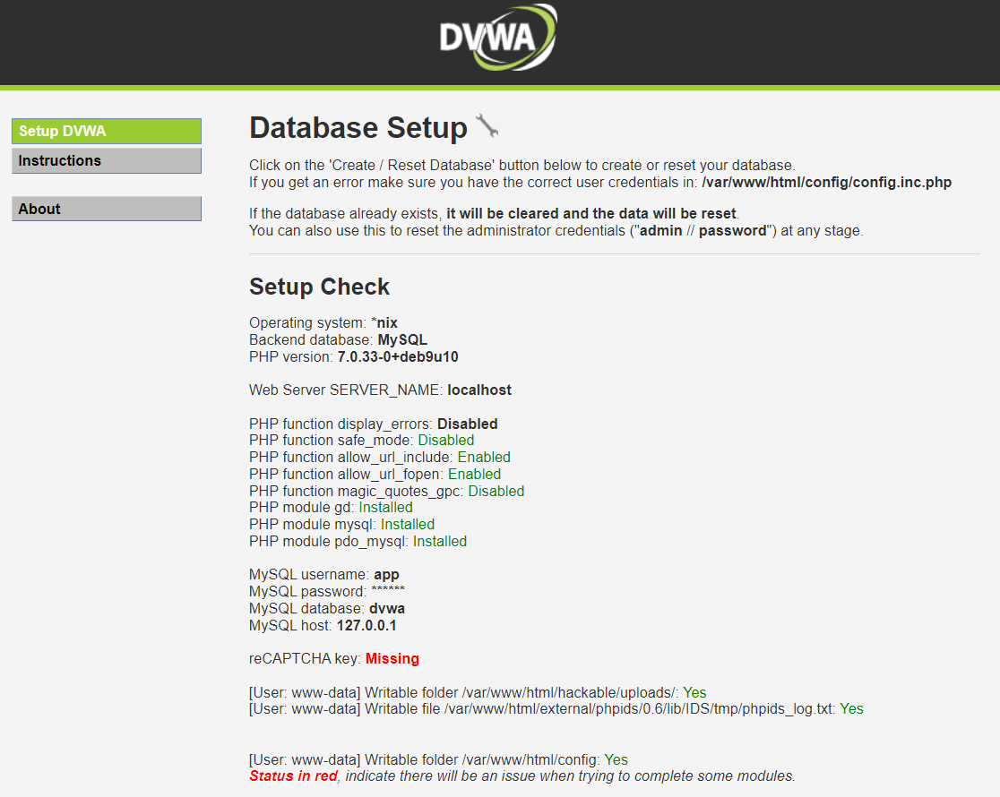
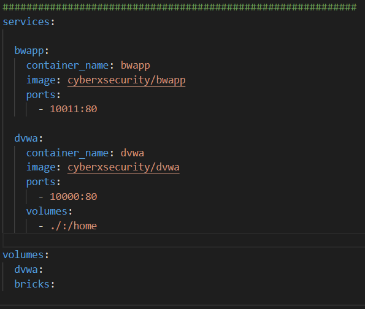

## Web-vulns-Environment
The docker-compose.yml file adds DVWA and BWapp instances on localhost for Web Pentesting

Pulls and adds all necessary components to run DVWA and BWapp to localhost:

 
  

  
 
  

    

      - BWapp runs on localhost:10011

    

      - DVWA runs on localhost:10000

Both these ports can be changed by changing the yml file.

Once repo is cloned, go path and run `docker-compose up`

 Note: Docker must be installed

